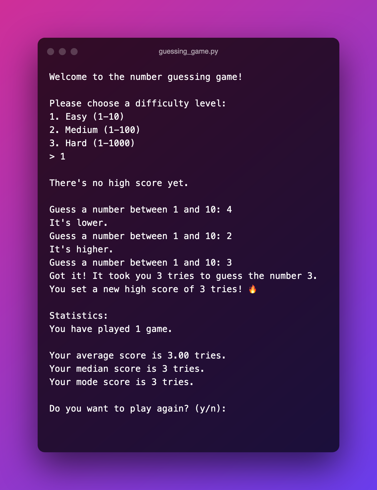

#  Team Treehouse - WebApp Dashboard

This is my first project for the [Data Analysis Techdegree at Treehouse](https://teamtreehouse.com/techdegree/data-analysis) at which was tasked with creating a Terminal based Number Guessing game.

## Table of contents

- [Overview](#overview)
  - [About this project](#about-this-project)
  - [Screenshot](#screenshot)
  - [How to Run](#how-to-run)
- [Process](#my-process)
  - [Technologies used](#technologies-used)
  - [What I learned](#what-i-learned)
  - [Continued development](#continued-development)
  - [Useful resources](#useful-resources)
- [Author](#author)
<!-- - [Acknowledgments](#acknowledgments) -->

## Overview

### About this project

Here are some of the key features in this project:

- Program runs, any exceptions are caught and handled, preventing crashes while it's running.
- The program welcomes the player upon starting a game
- Ask the user for a number within a given range
- Inform the user if their guess was too low or too high
- When the user has guessed the number correctly the game informs them about the number of guesses it took them
- User is prompted to play again after a game has been won
- When playing multiple times the user is being presented the statistics of their previous games (Mode, Median and Mean values)

#### Additional Features added

- When a user provides a number out of range they are asked to provide a new valid number
- Display a high score when starting a new game
- Added different difficulties so the user can choose to play with a variety of different number ranges
- Added some conditionals in the formatted stings to make sure that words are plural or singular depending on the number of tries and games

### Screenshot

### How to run

To run this project you can simply download the repo by clicking the green "Download" button in the top right of the repository. After navigating to the corresponding directory run `python3 guessing_game.py` and you can start playing!

## My process

### Topics used

- Python3
- functions
- conditionals
- while loops
- f-strings
- statistics module

### What I learned

It has been a while since I last wrote any Python code so definitely needed a refresher! I relearned about lists, conditionals and loops and got used to the syntax again pretty quickly. One new thing I learned was about the statistics module and the methods that it provides making me look forward to the upcoming units and projects in the Data Analysis Techdegree!

### Continued development

In the future I'd like to improve this project to include:

- Keep track of high scores based on the difficulty played
- Store the data for future games

### Resources

- [Treehouse: Introducing Lists](https://teamtreehouse.com/library/introducing-lists) - I found this course very helpful to understand interacting with lists and how to build while loops.
- [Blog on f-strings](https://towardsdatascience.com/five-wonderful-uses-of-f-strings-in-python-7980cfd31c0d) - I used the information from this blog to add conditionals to my f-strings

## Author

- Website - [Rohald.dev](https://www.rohald.dev)
- Team Treehouse - [Rohald89](https://www.teamtreehouse.com/rohald89)
- LinkedIn - [Rohald89](https://www.linkedin.com/in/rohald89/)

<!-- ## Acknowledgments -->
